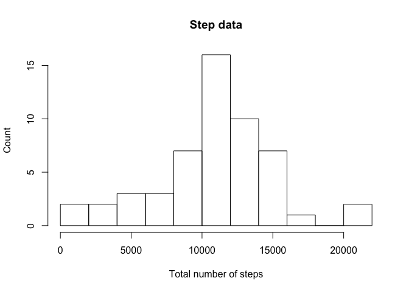
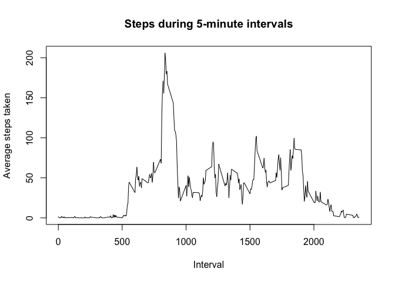
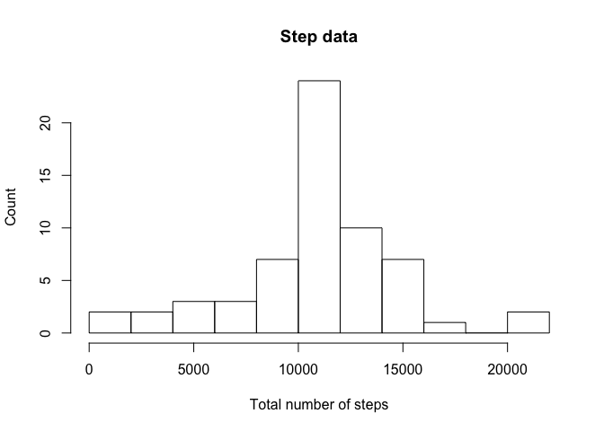
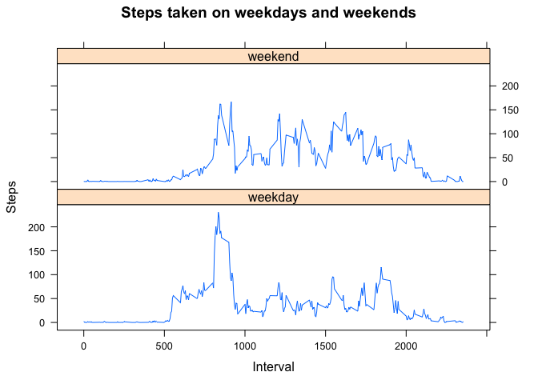

# Reproducible Research: Peer Assessment 1


## Loading and preprocessing the data

First we will load the file containing the subject's step data.
We have put this file in the current working directory.


```r
data <- read.csv("activity.csv")
```

## What is mean total number of steps taken per day?

To find the mean number of steps per day, we start by separately summing the 
number of steps on each date. Eliminate the days where there was no data (as opposed to assuming there were zero steps taken). Then we make a histogram of the result.


```r
daydata <- tapply(data$steps, data$date, sum)
daydata <- daydata[!is.na(daydata)]
hist(daydata, main="Step data", ylab="Count", xlab="Total number of steps", breaks=15)
```

 

Find the mean and median number of steps per day:

```r
mean(daydata)
```

```
## [1] 10766.19
```

```r
median(daydata)
```

```
## [1] 10765
```

## What is the average daily activity pattern?

We break down the step data into each five minute interval of the day and then plot the result.

```r
intervaldata <- tapply(data$steps, data$interval, mean, na.rm=TRUE)
plot(names(intervaldata),intervaldata,type = "l", xlab="Interval", ylab="Average steps taken", main="Steps during 5-minute intervals")
```

 

Now we find the interval with the largest number of steps taken on average.

```r
maxvalue <- max(intervaldata)
as.numeric(names(intervaldata)[intervaldata == maxvalue])
```

```
## [1] 835
```

## Imputing missing values
We calculate the total number of missing values in the dataset:

```r
nrow(data[is.na(data$steps),])
```

```
## [1] 2304
```
Fill in missing values by setting them equal to the median for that five
-minute interval over all days. Make a new "corrected" data frame:

```r
corrdata <- data
corrdata[is.na(data$steps),1] <- sapply(data[is.na(data$steps),3], function(x) intervaldata[names(intervaldata) == x])
```
To find the mean number of steps per day for the corrected data, we start by separately summing the number of steps on each date. Then we remake the histogram.


```r
corrdaydata <- tapply(corrdata$steps, corrdata$date, sum)
hist(corrdaydata, main="Step data", ylab="Count", xlab="Total number of steps", breaks=15)
```

 

Find new the mean and median number of steps per day:

```r
mean(corrdaydata)
```

```
## [1] 10766.19
```

```r
median(corrdaydata)
```

```
## [1] 10766.19
```

## Are there differences in activity patterns between weekdays and weekends?
We create a new factor variable in the dataset with two levels: "weekday" 
and "weekend" indicating whether a given date is a weekday or weekend day.

```r
library(dplyr)
```

```
## 
## Attaching package: 'dplyr'
## 
## The following object is masked from 'package:stats':
## 
##     filter
## 
## The following objects are masked from 'package:base':
## 
##     intersect, setdiff, setequal, union
```

```r
weekdays1 <- c('Monday', 'Tuesday', 'Wednesday', 'Thursday', 'Friday')
corrdata <- mutate(corrdata,daytype=factor(sapply(weekdays(as.Date(corrdata$date)), function(x) if (x %in% weekdays1) {"weekday"} else {"weekend"})))
```
Finally, we make a panel plot showing the step data in 5-minute intervals separated
by weekday versus weekend.

```r
groups <- group_by(corrdata,interval,daytype)
totals <- summarize(groups,mean(steps))
names(totals)[3] <- "meansteps"
library(lattice)
xyplot(totals$meansteps~totals$interval|totals$daytype,
   main="Steps taken on weekdays and weekends",
   ylab="Steps", xlab="Interval",type="l",layout=c(1,2))
```

 
